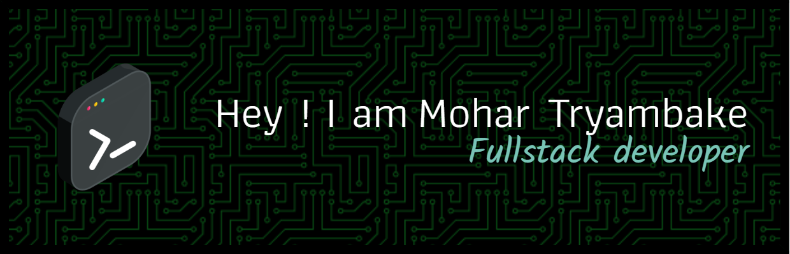

<!DOCTYPE html>
<html>
<body>
    

# 💫 About Me:
🌱 I’m currently learning everything 🤣 👯 I’m looking to collaborate with creators 🥅 2024 Goals: Expertise in web development

# 🌐 Socials:
    

# 💻 Tech Stack:
                                       
# 📊 GitHub Stats:
 
 

---
