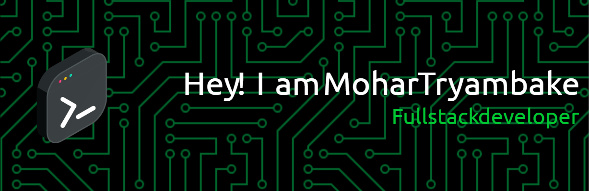

## I'm a Student, Developer and Engineer!!

-🌱 I’m currently learning everything 🤣

-👯 I’m looking to collaborate with content creators

-🥅 2024 Goals: Expertise in web development

&nbsp;

   

## Connect with me:
 

## GitHub Stats:

## Tech Stack:
      	            	                    

<!--START_SECTION:activity-->
<!--END_SECTION:activity-->

 
 
